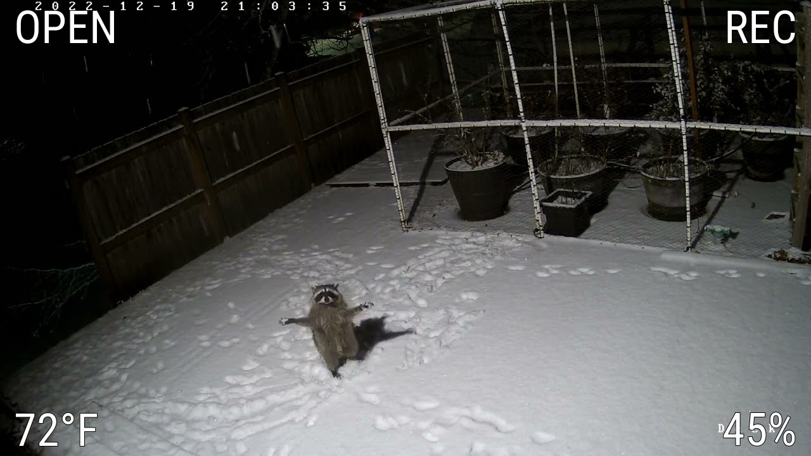
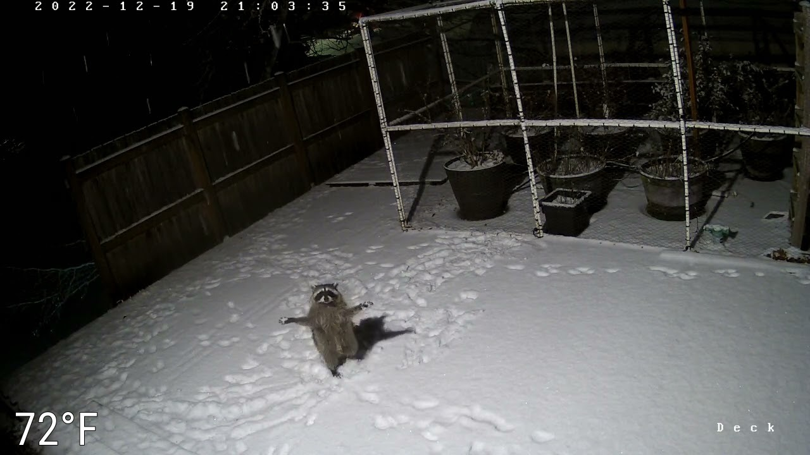
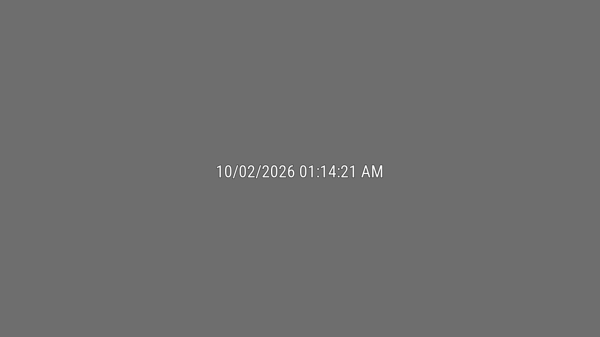

# imgstream

Turns a still JPEG into a camera stream. Draws a sensor value from Home Assistant on the frame.



One sensor per corner:




## What it does

Each container runs two programs.

A Python script fetches your image over HTTP. It checks the image is whole. It draws the sensor text on it. Then it saves the result to a file.

A second small script reads that file and serves it as an MJPEG stream. Any number of viewers can connect at once.

If you need RTSP rather than MJPEG, you can pipe this feed through go2rtc or a similar tool.

## Why

This project is an upgrade to a crude method using Motioneye that I was using to view still images from remote cameras.
If you have a camera that only saves snapshots, or you receive periodic overwritten images from a remote source, this turns them into a stream with Home Assistant data on top.


## What you need

- Docker with Docker Compose
- An image you can fetch over HTTP. Any web server works. Home Assistant's `/local/` folder works.
- Home Assistant, if you want sensor text on the frame


## Setup

### 1. Make a Home Assistant token

Skip this if you do not want sensor text.

The token is in plain view of the compose file and a token gets everything that user can do. If you want to be more security cautious you can use a non-admin user and make the token from there.


### 2. Deploy

Save this as `docker-compose.yml`.

```yaml
services:
  camera1:
    image: ghcr.io/sonomagts/imgstream:latest
    restart: unless-stopped
    ports:
      - "8084:8084"
    environment:
      IMAGE_URL: "http://HOST:PORT/PATH-TO-YOUR-IMAGE.jpg"
      STREAM_PORT: "8084"
      TZ: "Etc/UTC"
```

Start it:

```sh
docker compose up -d
```

Point your viewer at `http://<host>:<port>`. `TZ` is your timezone. See Timezone below if the placeholder timestamp looks wrong.

To add sensor text, add the settings from the next part.


## Configuration

Required:

| Variable | What it does |
| --- | --- |
| `IMAGE_URL` | The image to pull. Leave it blank and the container refuses to start. |
| `STREAM_PORT` | Port the stream answers on. Must match the number in `ports:`. |

Home Assistant:

| Variable | Default | What it does |
| --- | --- | --- |
| `HA_URL` | | Home Assistant address. No trailing slash. |
| `HA_TOKEN` | | Long-lived access token |
| `SENSOR_POLL_SECONDS` | `60` | How often to check Home Assistant |
| `SENSOR_HOLD_SECONDS` | `1800` | Seconds before an unreadable sensor shows `unavailable` |


### Sensors

Two ways to set this up. Use one.

**Short form.** One sensor, one corner:

```sh
SENSOR_ENTITY: "sensor.outdoor_temperature"
SENSOR_UNIT: "°F"
TEXT_CORNER: "bottom-left"
```

**Per corner.** Each corner gets its own entity and unit, so four values can share the frame:

```sh
SENSOR_ENTITY_BOTTOM_LEFT: "sensor.outdoor_temperature"
SENSOR_UNIT_BOTTOM_LEFT: "°F"
SENSOR_ENTITY_BOTTOM_RIGHT: "sensor.outdoor_humidity"
SENSOR_UNIT_BOTTOM_RIGHT: "%"
SENSOR_ENTITY_TOP_LEFT: "sensor.indoor_temperature"
SENSOR_UNIT_TOP_LEFT: "°F"
SENSOR_ENTITY_TOP_RIGHT: "sensor.pool_temperature"
SENSOR_UNIT_TOP_RIGHT: "°F"
```

`SENSOR_UNIT_` is optional. Each corner can use a different unit. Leave an entity blank and that corner stays empty.

Text:

| Variable | Default | What it does |
| --- | --- | --- |
| `TEXT_ENABLED` | `true` | Draw the sensor on the frame. Must be exactly `true` or `false` |
| `TEXT_CORNER` | `bottom-left` | `bottom-left`, `bottom-right`, `top-left`, `top-right`. Which corner the short form uses |
| `TEXT_COLOR` | `#FFFFFF` | Color of the sensor text |
| `BASE_FRAC` | `0.10` | Text size, as a fraction of image height |
| `MAX_WIDTH_FRAC` | `0.40` | Long values shrink to fit this fraction of image width |
| `UNAVAILABLE_TEXT` | `unavailable` | Shown instead of a number when the sensor dies |

Position, if the defaults do not fit your frame:

| Variable | Default | What it does |
| --- | --- | --- |
| `MARGIN_X` | `6` | Pixels from the left or right edge. Or a percentage, like `2%`. |
| `MARGIN_BOTTOM` | `8` | Pixels from the bottom or top edge. Or a percentage. |

Colors are hex. The `#` is optional. `#fff` works the same as `#ffffff`. Case does not matter. The text keeps a black outline whatever color you pick, so it stays readable on a bright picture.

`MARGIN_X_TOP_RIGHT` and the other per-corner variables change one corner only.

The default margins are made for a small frame, around 352x200. On anything bigger they look cramped. That is why the example uses `MARGIN_X: "1.7%"` and `MARGIN_BOTTOM: "4%"`. Those give the same gap at any size.

The placeholder timestamp has its own size. The sensor text scales with the frame. That one should not:

| Variable | Default | What it does |
| --- | --- | --- |
| `STAMP_SIZE` | `17` | Placeholder timestamp size in pixels |
| `STAMP_FORMAT` | `%m/%d/%Y %I:%M:%S %p` | How the placeholder timestamp is laid out. A strftime pattern. For example `%d.%m.%Y %H:%M:%S` |

Timing and the grey screen:

| Variable | Default | What it does |
| --- | --- | --- |
| `STALE_SECONDS` | `60` | No new image for this long shows the grey screen |
| `POLL_SECONDS` | `5` | How often to fetch the image URL |
| `HTTP_TIMEOUT` | `10` | Seconds before giving up on a request that stalls |
| `PLACEHOLDER_COLOR` | `#6e6e6e` | Grey screen color |
| `TZ` | `Etc/UTC` | Timezone for the placeholder timestamp |
| `DIAGNOSE` | `false` | Log timing for each new frame. See below |
| `DIAGNOSE_AGE` | `false` | Add the source age to that line. Read the warning first |


### Finding out where the delay is

If it seems there is an added delay,

Set `DIAGNOSE: "true"`. Each new frame gets one line:

```
diagnose: fetch 53ms, 12KB, render 2ms, waited 0.4s for our poll
```

- **fetch** — downloading the image
- **render** — decoding, drawing the text, saving
- **waited** — how long the frame sat there before our poll found it. If your source updates faster than `POLL_SECONDS`, expect half the interval

Turn it off when you are done. It logs a line per frame, and that adds up fast.

#### The source age

`DIAGNOSE_AGE: "true"` turns on both. Setting it alone is enough. The startup log tells you what is on:

```
compositor: diagnose     on with source age
```

That adds one more number:

```
diagnose: fetch 53ms, 12KB, render 2ms, waited 0.4s for our poll, source age 45.5s
```

`source age` is how old the file was when we fetched it. That covers your whole setup, plus our poll wait.


If the image is being hosted remotely and the system clocks are more than half a second apart, the line says so:

```
..., source age -0.7s, WARNING source timestamp is 0.7s in the future, the clocks disagree and this age is meaningless
```

A negative age proves the system clocks are out of sync. If you see that, sync the clocks on both machines, or ignore the number. The other three are fine either way.


### Timezone

`TZ` only changes the placeholder timestamp. You should set it. Containers run on UTC by default. If your machine is not on UTC, the placeholder shows a time hours off.

`TZ` takes an IANA name, like `America/New_York` or `Australia/Sydney`.

Or follow the host instead of naming it:

```yaml
volumes:
  - /etc/localtime:/etc/localtime:ro
```


## How it behaves

**Grey screen.** After `STALE_SECONDS` with no usable image, you get a grey frame with the date and time on it. So you can see how old the feed has been broken. No sensor value shows on it.



**Half-written images get dropped.** An FTP upload that is still running makes a broken JPEG. We skip it. The last good frame stays up.

**A dead sensor does not kill the feed.** A short Home Assistant outage holds the last reading. After `SENSOR_HOLD_SECONDS`, it shows `unavailable`. A good reading resets that timer.

**Text scales with the image.** `BASE_FRAC` is a fraction of image height. So one setting looks the same on 352x200 and on 1080p. Margins are pixels unless you add a `%`.


## Things to watch for

| Setting | What goes wrong |
| --- | --- |
| `POLL_SECONDS` higher than `STALE_SECONDS` | A working camera stuck on the grey screen |
| `STALE_SECONDS` lower than how often your source updates | Grey screen on a working camera, most of the time |
| `TEXT_ENABLED` misspelled | No text, and no error. Only `true` and `false` count, so `yes` means no |
| Pixel margins on a big frame | Text jammed in the corner, hard to read |

The second one bites the most often. If your image updates every 20 minutes, `STALE_SECONDS` needs to be well above that.


## Limits

**Sensor values show exactly as they are.** No unit conversion. No rounding. Whatever Home Assistant reports is what you see. If you want `72°F`, have the sensor report `72` and set `SENSOR_UNIT` to `°F`.


## Output

MJPEG over HTTP, using `multipart/x-mixed-replace`. Every frame is a whole JPEG on its own. A dropped packet costs you one frame, not the stream.

Any number of viewers can connect at once.

| Variable | Default | What it does |
| --- | --- | --- |
| `STREAM_FPS` | `2` | Frames per second sent to each viewer. The frame only changes when a new image lands, so more frames show the same picture more often |


## When it goes wrong

**Grey screen with a timestamp on it.** No usable image for `STALE_SECONDS`. Open `IMAGE_URL` in a browser. If it loads there, the source is fine. The problem is between the source and the container.

**The placeholder timestamp is hours off.** The container is on UTC. Set `TZ`, or mount `/etc/localtime`.

**Nothing on the port.** Check the container is running, then read its logs:

```sh
docker compose logs
```

The first line says what it is serving and on which port. That is the quickest way to check your settings landed.

**No text on the frame.** `TEXT_ENABLED` only takes `true` or `false`. So `yes` and `True` both count as no, with no error. Also check the token. A bad token fails quietly for the first `SENSOR_HOLD_SECONDS`.

**No text, and you set both sensor forms.** A blank per-corner variable still counts as set. It beats the short form. Delete one of them.

**Text in the wrong spot.** `MARGIN_X` and `MARGIN_BOTTOM` are pixels, not percentages. So they look right at one size and cramped at another. Add a `%` to make them scale. The startup log tells you which one it read.


## License

MIT. See [LICENSE](LICENSE).

The bundled font, `fonts/RobotoCondensed.ttf`, is Roboto Condensed from Google Fonts. It is under the Apache License 2.0.
